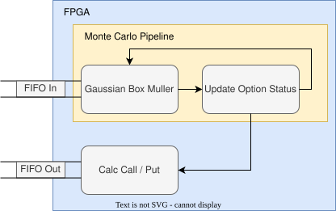

For this project, our team built a hardware accelerator for Monte Carlo–based options pricing using high-level synthesis (HLS) targeting a Xilinx FPGA on a ZedBoard. We implemented a Black–Scholes–style Monte Carlo simulation that estimates European call and put prices by sampling millions of Gaussian random variables and aggregating discounted payoffs.

On the hardware side, we designed the core simulation in C++ for HLS, then synthesized it to RTL and integrated it with the ARM CPU via the Xillybus streaming interface. A custom Gaussian random number generator based on the polar Box–Muller transform uses two LFSR-based pseudo-random number generators to produce independent samples. The accelerator consumes simulation parameters (spot price, strike, volatility, rate, time to expiry, path count) from the CPU, runs the Monte Carlo kernel entirely on the FPGA, and streams back the estimated call and put prices.

To make the design performant on real hardware, we explored a series of HLS optimizations: pipelining the main simulation loop, selectively unrolling inner loops (e.g., in a custom exponential function), aggressive function inlining, and adopting float instead of double to reduce area and latency. We also experimented with dependency removal and partial-sum accumulators to drive the pipeline initiation interval down, trading off resource usage against throughput.

Across the design space, the fully optimized implementation achieved a ~930× speedup over the ARM CPU software baseline and ~225× over the unoptimized FPGA design, at the cost of higher DSP, FF, and LUT utilization—an attractive tradeoff for latency-sensitive financial workloads where speed is paramount.